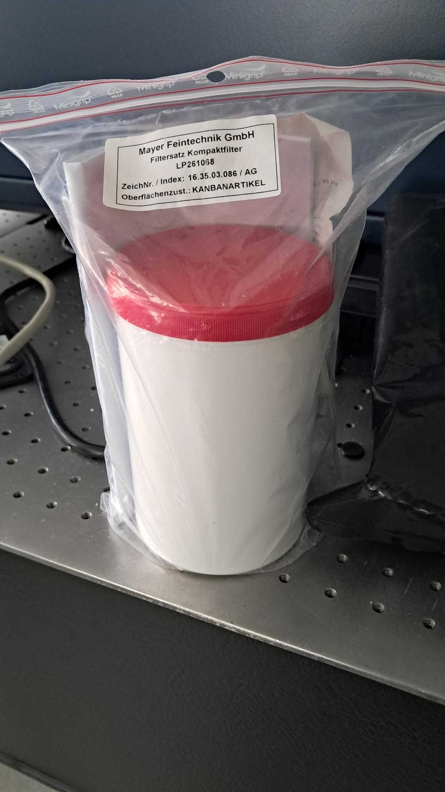

# System Maintenance Instructions for Changing the Florine Filter

## Overview

How to change fluorine filter. Filter inside this container.

## Prerequisites

List any prerequisites needed before performing the maintenance, such as tools, software versions, access permissions, or previous configurations.

## Safety Precautions

- Make sure all gas lines are closed and empty
- Make sure you have safety googles on
- Do NOT use metal tools. Be careful to not scratch any parts as this can cause leaks.

## Maintenance Schedule

- **Frequency:**  Whenever the laser keypad gives message `RENEW HALOGEN FILTER`
- **Expected Duration:**  < 1 hr

## Required Tools and Materials

- Filter kit: Comes with filter, user guide, spring, and 4 gaskets (2 thin, 2 thick)

- Gloves
- isopropyl alcohol and wipes

## Personnel

- Anyone, but call Frank for guidance

## Maintenance Procedure

### Step 1: Preparation
- Initial filter setup. Laser should be off.

### Step 2: Remove old parts
- Unscrew butterfly screws and washers. Inside is a spring, aluminum casing and filter inside. On the lid, there are 2 rubber gaskets. Remove these gaskets

- Remove the aluminum casing. Might have to use some force. The filter is now exposed with an arrow pointing down. This is the correct orientation.

- Remove the gaskets from the bottom of the filter (thicker) and the base where the filter sits (thinner).

### Step 3: Replace new parts
- Wipe down the surfaces where the gaskets sit with IPA

- Check that the new gaskets and filter are all clean and dust free. Check that there are no tears or dents. If there are, call Frank.
- Replace the smaller thin gasket.

- put the aluminum casing back on, and press the thicker gasket inside.

- Carefully seat the filter inside

- Press the thicker gasket around the edges of the filter and aluminum casing.

- Replace the thinner gasket around the lid for the filter. Make sure it is firmly seated in the groove and down not slide off. 

- Put the spring on the lid, with the wide side up

- Put the lid down and replace washers and butterfly screws. Screw each one down incrementally, so the lid is level and all screws are tightened uniformly.

### Step 4: Cleanup

- Turn on the laser (key and switch in back) and press f4 on the control panel. Set the `FILTER FILLING RATIO` to   `0`. Hit `ENTER`, `EXECUTE`

- Put the old filter back inside the white container with red lid. Record the date the filter was changed on the container and put back in bag.
- Fill a Chemical Pickup Request with Environmental Health and Safety at: https://drexel.edu/facilities/healthsafety/servicerequests/chemicalpickuprequest
- If necessary, follow instructions for flushing line and refilling laser.

## Troubleshooting

- Might need some hard thin plastic tools to get the gasket on.
- For other problems, call Frank

## Documentation and Records

- Add the date of filter change to the list below:

### Filter changed on:
- Sept. 17, 2024

## Appendix

- Additional information, if any, that will assist in the maintenance of the system.
