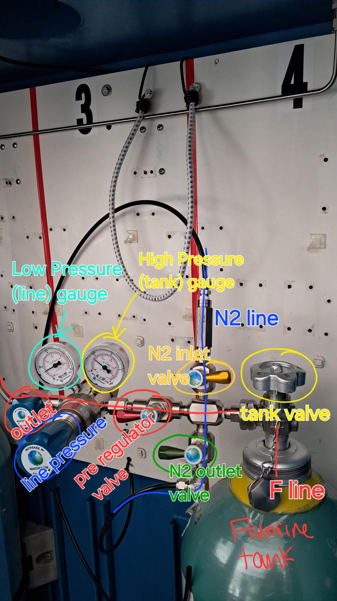

# System Maintenance Instructions for Filling Laser

## Overview

How to refill laser. This should be done if the filter is changed, if the pressure is low, or if the energy is low.

## Prerequisites

List any prerequisites needed before performing the maintenance, such as tools, software versions, access permissions, or previous configurations.

## Safety Precautions

- Be sure to wear glasses.
- Start with all valves closed on gas lines

## Maintenance Schedule

- **Frequency:** When necessary.
- **Expected Duration:** < 15 min

## Required Tools and Materials

- Tool 1
- Tool 2
- Spare parts or materials needed

## Personnel

- Roles and responsibilities of personnel involved in the maintenance process.
- Required skill levels or certifications if applicable.

## Maintenance Procedure

### Step 1: Preparation
- Initial setup:

- Close all gas lines. All valves should be perpendicular to line.
- Turn on laser and wait for warmup

### Step 2: Flush Fluorine line
- Open the three valves on the fluorine line: The tank valve, pre-regulator valve, and outlet
- close the red pre-regulator valve.
- on control panel, press `FLUSH`. Select 

### Step 3: Verification
- Steps to verify that the system is functioning correctly post-maintenance.
- Any tests that should be performed to ensure system integrity.

### Step 4: Cleanup
- Instructions on how to clean up the workspace after completing maintenance.
- How to properly dispose of any used materials or waste products.

## Troubleshooting

- Common issues that might arise during maintenance and how to resolve them.
- Contact information for further support.

## Documentation and Records

- Information on how to document the maintenance performed.
- Where and how to update maintenance records.

## Appendix

- Additional information, if any, that will assist in the maintenance of the system.
